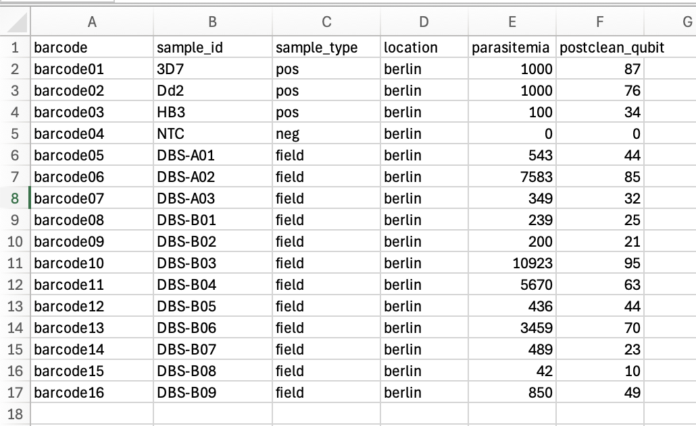

## Quick summary

To run *Nomadic*, open a terminal window and type the following:

```
conda activate nomadic
cd <path/to/your/workspace>
nomadic realtime <expt_name>
```

- `<path/to/your/workspace>` should be replaced with the path to your *Nomadic* workspace.
- `<expt_name>` should be replaced with the name of your experiment.
    - You should have given your experiment the same name in *MinKNOW*.
    - You should have given your metadata file this name, and put it in your workspace metadata folder (`<path/to/your/workspace>/metadata/<expt_name>.csv`).

The dashboard will open in a browser window on your computer. 

<!-- 1. Create a workspace if you have not already (`nomadic start pfalciparum`).
2. Pick an experiment name (e.g. `2025-06-21_first-sequencing`)
3. Start your sequencing run with *MinKNOW* using your experiment name.
4. Put your metadata file in the `metadata` folder in your *Nomadic* workspace. Name the file with your experiment name (e.g. `2025-06-21_first-sequencing.csv`).
5. Start *Nomadic*: `nomadic realtime 2025-06-21_first-sequencing` -->


---
## Detailed instructions

### Before starting
Before starting make sure you have installed *Nomadic* (see [Installation](installation.md)). 

Then, open a terminal window and activate the *Nomadic* environment:

```
conda activate nomadic
```


### Starting a workspace

*Nomadic* creates workspaces to help organise your input data and analysis results. A workspace is just a folder on your computer where all of the input data needed to run *Nomadic*, as well as your analysis results, are stored. You can create a workspace with the following command:

```
nomadic start pfalciparum
```

By default the name of the new workspace is `nomadic`. You can enter the workspace by typing:

```
cd nomadic
```

Inside of the workspace, you should see the four folders.

| Folder | Contents |
| --- | --- |
| `beds` | Contains information about amplicons used in sequencing. |
| `metadata` | Where you should put all of your metadata files. |
| `resources` | Contains information about the reference genome. By default, this is the *P. falciparum* 3D7 reference genome downloaded from [plasmodb](https://plasmodb.org/plasmo/app). |
| `results` | Where the results from running *Nomadic* will go. Initially it will be empty. |


### Using *Nomadic* for real-time analysis
*Nomadic* can process nanopore squencing data being produced by *MinKNOW* in real-time. To do so, follow the steps below.

**Step 1: Start nanopore sequencing with *MinKNOW***

Use *MinKNOW* to start nanopore sequencing. Make sure to take note of the experiment name, you will need this in later steps.


**Step 2: Create a metadata file**

Create a metadata file containing information about what barcodes you have used and their associated sample IDs. Here is an example:


{ .centered width="75%" }

Only the `barcode` and `sample_id` columns are mandatory. The rest are optional, and you are also free to include any other columns you like.

Move your metadata file into the metadata folder of your *Nomadic* workspace, and give it the same experiment name you used with *MinKNOW* (`<path/to/your/workspace>/metadata/<expt_name>.csv`).


**Step 3: Run**

Open a terminal window and start the nomadic conda environment:

```
conda activate nomadic
```

Now navigate to your workspace folder:

```
cd <path/to/your/workspace>
```

And launch *Nomadc*:


```
nomadic realtime <expt_name>
```

The dashboard will open in a browser window on your computer. 

### Using *Nomadic* to view a completed experiment

Once an experiment is completed, you can still open the *Nomadic* dashboard to view your results.

**Step 1. Activate the *Nomadic* environment.**


Open a terminal window and activate the *Nomadic* environment:

```
conda activate nomadic
```

**Step 2. Navigate in terminal to your workspace.**


If you created your workspace in your home folder, this will simply be:
```
cd <path/to/your/workspace>
```

**Step 3. Open the dashboard.**


To open the dashboard of a specific experiment, you only need to know the experiment name. You can then open the dashboard by running:
```
nomadic dashboard <expt_name>
```
Where you should replace `<expt_name>` with the name of the experiment.

