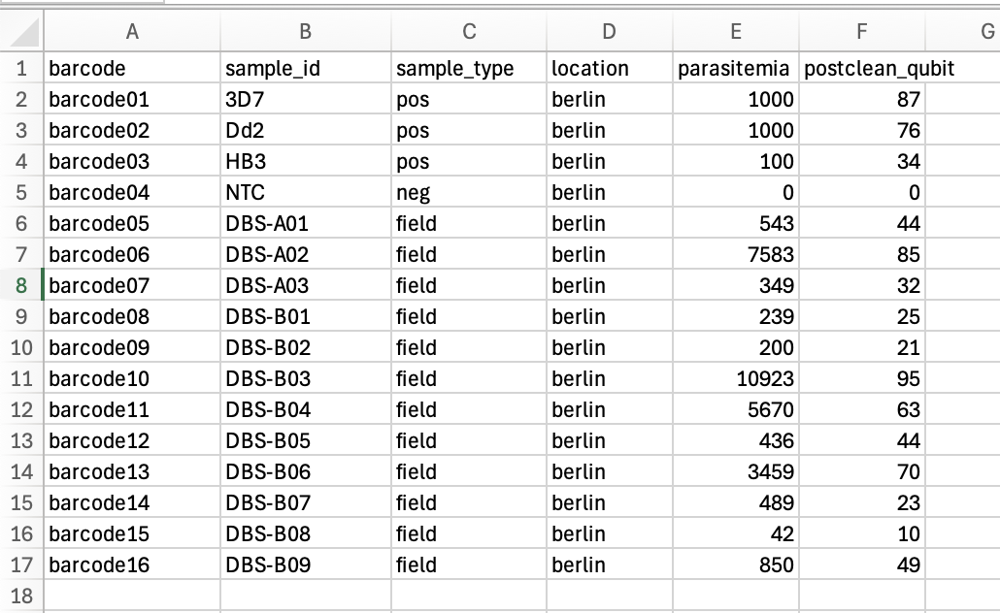
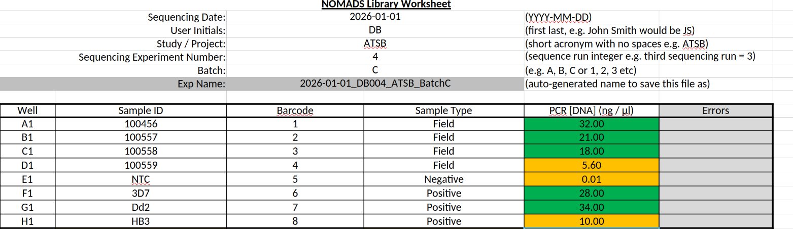

## Running *Nomadic*
Whenever you want to run *Nomadic*, first do the following:

- Make sure you have installed *Nomadic* from bioconda(see [Installation](installation.md)). 

- Open a terminal window and activate the *Nomadic* environment:

```
conda activate nomadic
```

- Navigate to your workspace (or location you want to create one - see next section)

```
cd path/to/your/workspace
```

## Starting a workspace

*Nomadic* creates workspaces to help organise your input data and analysis results. A workspace is just a folder on your computer where all of the input data needed to run *Nomadic*, as well as your analysis results, are stored. You can create a workspace with the following command:

```
nomadic start pfalciparum
```

By default the name of the new workspace is `nomadic`. You can enter the workspace by typing:

```
cd nomadic
```

Inside the workspace, you should see the following folders:

| Folder | Contents |
| --- | --- |
| `beds` | Contains information about amplicons used in sequencing. |
| `metadata` | Where you should put all of your metadata files. |
| `results` | Where the results from running *Nomadic* will go. Initially it will be empty. |


## Analysing a sequencing run in realtime
*Nomadic* can process nanopore squencing data being produced by *MinKNOW* in real-time. To do so, follow the steps below.

**Step 1: Create a metadata file**

Create a metadata file containing information about what barcodes you used in the sequencing library and their associated sample IDs. You can do this by manually entering values into a csv (comma separated value) file:

{ .centered width="75%" }

Only the `barcode` and `sample_id` columns are mandatory. The rest are optional, and you are also free to include any other columns you like.

Alternatively you can complete the Excel template ("NOMADS_Library_Worksheet.xlsx", stored in the metadata folder). The sheet guides a user through data entry including data validation checks and generates a experiment name that the file should be saved as. Post-PCR gel images can also be saved in this template for future reference.

{ .centered width="105%" }

The csv / excel file must be saved in the *metadata* folder of your workspace.

**Step 2: Start nanopore sequencing with *MinKNOW***

Use *MinKNOW* to start nanopore sequencing. Ensure you give *MinKNOW* the **exact** experiment name you gave your metadata file.

**Step 3: Start *Nomadic***

Launch *Nomadic* to start analysis, the dashboard will open in a browser window on your computer:

```
nomadic realtime <expt_name>
```


## Viewing a completed experiment

Once an experiment is completed, you can still open the *Nomadic* dashboard to view your results by running:
```
nomadic dashboard <expt_name>
```