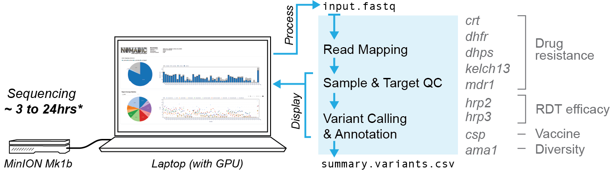
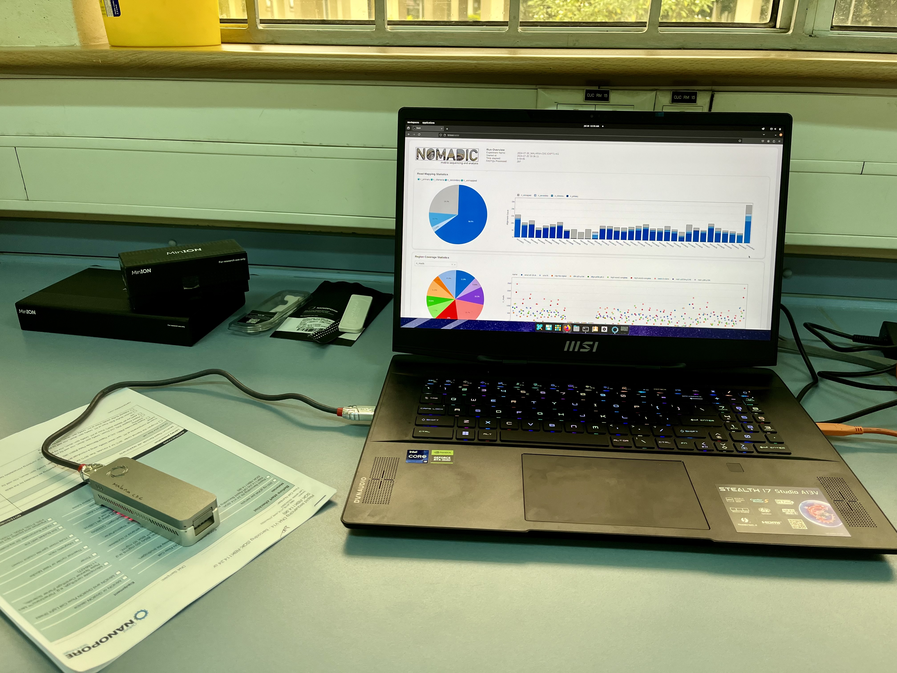

#

---

## Overview
*Nomadic* is a real-time bioinformatics pipeline and dashboard for nanopore sequencing data. While sequencing is still ongoing, it performs read mapping and sample quality control, as well as variant calling and annotation. This information is displayed in real-time to a graphical dashboard that has interactive features.

It was designed to work with amplicon sequencing data from the NOMADS-MVP protocol, which targets a panel of genes important for the control of *Plasmodium falciparum* malaria (see [Basic Usage](basic.md)). However, it was coded flexibly and works with other organisms or amplicon panels (see [Advanced Usage](advanced.md)).

 

<!-- *Nomadic* being used to process *P. falciparum* data in Kisian, Kenya. For more cool pictures, see our gallery. -->
 

## Features
- [x] Real-time read mapping with [*Minimap2*](https://github.com/lh3/minimap2).
- [x] Real-time sample quality control and amplicon coverage evaluation.
- [x] Real-time variant calling with [*bcftools*](https://github.com/samtools/bcftools). These calls are preleiminary; treat with caution.
- [x] Support for different reference genomes or amplicons panels.

## Resources

- The NOMADS-MVP protocol is available in [English](https://www.protocols.io/view/nomads-mvp-rapid-genomic-surveillance-of-malaria-w-kxygxy284l8j/v1) and [French](https://www.protocols.io/view/surveillance-g-nomique-du-paludisme-par-la-m-thod-q26g75b5qlwz/v1).
- Read our preprint [here](https://www.biorxiv.org/content/10.1101/2025.07.23.666274v1).

## Acknowledgements
This work was funded by the Bill and Melinda Gates Foundation (INV-003660, INV-048316).