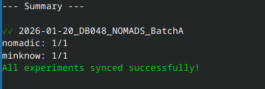

## Backing up

To create a complete backup of your workspace e.g. to an external hard disk drive or other location accessible on or from your computer (including an ssh location): 

```
nomadic backup -t <path/to/your/backup/location>
```

The backup process will also backup all minknow data so be prepared for it to take a while the first time you run it. At the end you will see a short summary:


{ .centered width="75%" }


## Sharing data

The results folder for an experiment (`results/<expt_name>`) contains all the outputs from *Nomadic*. Only the CSV files starting `summary` and the `metadata` folder are required to relaunch the dashboard with the `nomadic dashboard` command (see [Basic Usage](basic.md)). `Nomadic` allows easy sharing of your workspace by copying key summary `Nomadic` and `MinKNOW` files to a new location, e.g. a cloud synchronised folder. 

```
nomadic share -t <path/to/your/shared/location>
```

Once shared, `Nomadic` can be run by collaborators and other members of the group as needed.

## Configuring default values

The above settings can be saved per workspace so that you don't need to enter the details each time. To save the configuration do the following:

```
nomadic configure backup -t <path/to/your/backup/location>
nomadic configure share -t <path/to/your/shared/location>
```

Once configured you can omit the `-t` option e.g.
```
nomadic backup
nomadic share
```