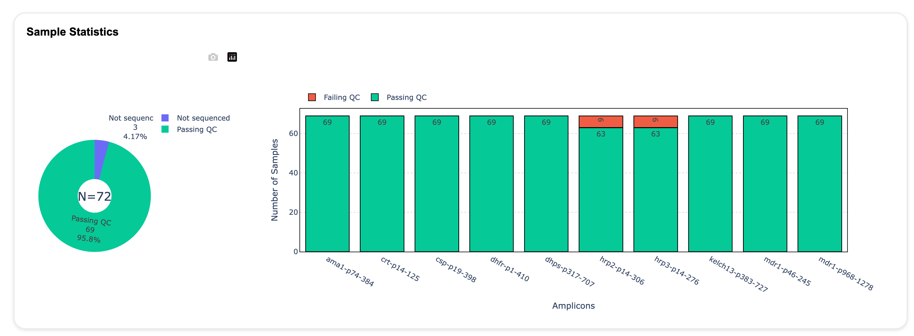
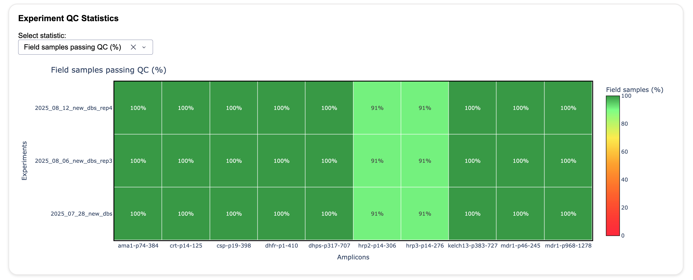
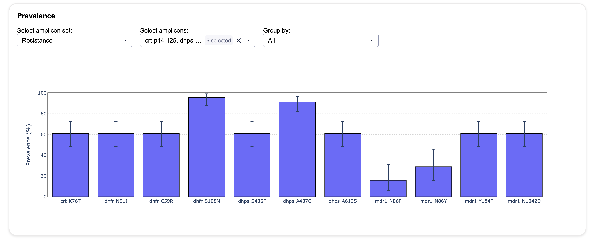

## Summarising completed experiments

The `nomadic summarize` command combines the results of several completed *Nomadic* experiments. It evaluates quality control, combines variant calls, calculates mutation prevalence, and creates a dashboard for exploring the results across samples and experiments.

Use `nomadic summarize` after the individual experiments have been processed with `nomadic realtime`.

!!! note
    The experiments included in one summary must use the same reference genome, variant caller, and amplicon regions. *Nomadic* checks these inputs before beginning the summary analysis.

## Before you start

You need:

- One or more completed *Nomadic* experiment directories (full, or shared through `nomadic share`).
- A master metadata CSV containing the samples to include.
- The same reference genome, variant caller, and amplicon panel in every experiment.
- Negative controls in all included experiments if you want contamination to be evaluated by the default QC workflow.

The master metadata CSV must contain a `sample_id` column. The sample IDs are matched to the sample IDs in the experiment metadata. Leading and trailing whitespace is removed, but sample IDs must otherwise match exactly and must be unique in the master metadata file.

Other columns in the master metadata file are retained in the summary. They can also be used to calculate prevalence separately for groups of samples with `--prevalence-by`.

By default, *Nomadic* looks for the master metadata file at:

```
<workspace>/metadata/<summary_name>.csv
```

You can use `--no-master-metadata` to create a quick overview using the samples found in the experiments. This is not recommended for a final analysis because it does not explicitly define which samples should be included.

## Quick start

When you are inside a workspace, summarize all experiment directories in that workspace with:

```
nomadic summarize
```

The default summary name is the workspace name, and the output is written to:

```
<workspace>/summaries/<summary_name>/
```

The dashboard opens automatically when the analysis is complete. To summarize a particular set of experiments, provide their directories explicitly:

```
nomadic summarize \
    results/experiment-01 \
    results/experiment-02 \
    --metadata_csv path/to/master-metadata.csv \
    --summary_name malaria-cohort \
    --output-dir path/to/summaries/malaria-cohort
```

To calculate prevalence separately for one or more metadata columns, provide a comma-separated list to `--prevalence-by`. The column names specified must exist in the master metadata CSV. (Only necessary if you want to write the prevalence files.):

```
nomadic summarize --prevalence-by country,collection_site
```

To open a summary that has already been calculated without recalculating it, use `--only-dashboard`:

```
nomadic summarize --only-dashboard
```

## Command options

### Input and metadata

| Option | Description |
| --- | --- |
| `EXPERIMENT_DIRS` | One or more experiment directories. If omitted inside a workspace, all experiment directories in the workspace are used. |
| `--workspace` | Workspace containing the experiments, metadata, and summary output. (Optional, but needed if you want to use defaults for other options.) |
| `-m`, `--metadata_csv` | Master metadata CSV. It must contain a unique `sample_id` column. The default is `<workspace>/metadata/<summary_name>.csv`. |
| `-n`, `--summary_name` | Name of the summary. The default is the workspace name. |
| `--no-master-metadata` | Use samples discovered in the experiments instead of requiring a master metadata CSV. This is intended for a quick overview. |

### Summary and dashboard

| Option | Description |
| --- | --- |
| `-o`, `--output-dir` | Directory where the summary is stored. The default is `<workspace>/summaries/<summary_name>`. |
| `--dashboard` / `--no-dashboard` | Start or suppress the dashboard after the analysis. The dashboard is started by default. |
| `--only-dashboard` | Open an existing summary dashboard without recalculating the summary. |

### Performance and logging

| Option | Default | Description |
| --- | ---: | --- |
| `-t`, `--threads` | `8` | Number of threads used for analysis. |
| `-v`, `--verbose` | disabled | Increase logging verbosity for debugging. |

### Prevalence

| Option | Description |
| --- | --- |
| `--prevalence-by COLUMN[,COLUMN...]` | Calculate prevalence separately for one or more metadata columns. Pass multiple columns as a comma-separated list. |

For example, `--prevalence-by country,site` creates separate prevalence files for each country and site grouping.

### Quality control

| Option | Default | Description |
| --- | ---: | --- |
| `--qc-min-coverage` | `100` | Minimum mean coverage required for an amplicon to pass coverage QC. |
| `--qc-max-contam` | `0.1` | Maximum relative contamination fraction. |
| `--qc-replicate-passing-threshold` | `0.8` | Minimum fraction of passing amplicons required for a replicate to pass QC. The value must be between `0` and `1`. |

## Quality control

Quality control is evaluated for each amplicon and sample. An amplicon fails low-coverage QC when its mean coverage is below `--qc-min-coverage`.

Contamination is evaluated using the mean coverage of negative controls from the same experiment and amplicon. A sample can fail because:

- The negative-control coverage is at least `--qc-min-coverage` (absolute contamination).
- The negative-control coverage is at least `--qc-max-contam` of the sample coverage (relative contamination).

An amplicon passes when it has sufficient coverage and does not fail contamination QC. The amplicon results are then combined into replicate, sample, and experiment summaries. By default, a replicate must have at least 80% passing amplicons to pass QC.

Only samples and amplicons in the analysis set are used for the downstream variant and prevalence results. The QC files retain the individual failure flags so that results can be investigated in more detail.

## Variant and prevalence analysis

The summary loads the variant calls from each experiment and combines them into summary VCF and CSV files. Calls are filtered to the QC analysis set, panel-specific exclusions are applied, and variants that are never observed are removed from the summary results.

The overall prevalence files report how frequently each observed amino-acid change occurs among the included samples. When `--prevalence-by` is used, additional files report prevalence for each value of the selected metadata column.

The `aa_call`, `gt`, and WSAF columns use the same call categories and within-sample allele-frequency interpretation as the individual experiment results. See [Output files](output_files.md) and [Understanding the Dashboard](understand.md#variant-calling) for more information.

## Summary output

A completed summary has the following structure:

```
<summary-dir>/
├── metadata/
│   ├── master_metadata.csv
│   └── <panel>.amplicons.bed
├── seq_inventory/
│   ├── sample_inventory.csv
│   └── samples.by_experiment.csv
├── quality_control/
│   ├── coverage.csv
│   ├── replicates_qc.csv
│   ├── samples_qc.csv
│   ├── samples_amplicons_qc.csv
│   └── experiments_qc.csv
├── variants/
│   ├── aa_changes.csv
│   ├── nt_changes.csv
│   ├── prevalence.aa_changes.csv
│   ├── prevalence.aa_changes.by-<column>.csv
│   └── vcfs/
│       ├── variants.filtered.vcf.gz
│       └── variants.annotated.vcf.gz
```

| Directory | Contents |
| --- | --- |
| `metadata/` | The normalized master metadata and amplicon BED file used by the experiments. |
| `seq_inventory/` | The sample inventory and sequencing throughput summary. |
| `quality_control/` | Amplicon-, replicate-, sample-, and experiment-level QC summaries. |
| `variants/` | Combined amino-acid and nucleotide change tables, prevalence tables, and the `vcfs/` directory. |

The detailed columns in the variant tables are described in [Output files](output_files.md). Coverage and QC tables include the sample and experiment identifiers, amplicon coverage, contamination measurements, failure flags, and passing status.

If the panel defines amplicon sets, the summary writes separate amino-acid change and prevalence files for each set. For example, a set named `Resistance` produces `variants/aa_changes.resistance.csv` and `variants/prevalence.aa_changes.resistance.csv`. When prevalence is grouped by metadata, the corresponding file is named `variants/prevalence.aa_changes.resistance.by-<column>.csv`.

## Summary dashboard

The summary dashboard provides an overview of the combined experiments. Its main views include:

- Throughput and sample inventory, including included and excluded samples.
- Sample QC status and amplicon coverage.
- Experimental QC metrics, including amplicon coverage, low coverage and contamination.
- Variant prevalence across the included samples.

The **Sample Statistics** view summarizes the number of samples passing QC for each amplicon and shows samples that were not sequenced.



The **Experiment QC Statistics** view compares QC performance between experiments. The statistic shown can be changed using the selector above the plot.



The **Prevalence** view shows the prevalence of selected variants and can group results by metadata columns.



The dashboard is launched automatically after a summary is calculated unless `--no-dashboard` is used. It can be reopened later with `--only-dashboard`.

## Troubleshooting

### The metadata file cannot be loaded

Check that the file is a readable CSV and contains a column named `sample_id`. Confirm that the sample IDs are unique and match the IDs in the experiment metadata. Check that the file is in the correct location within the workspace.

### No samples are included

The master metadata file controls which samples enter the summary. Check that its `sample_id` values match the experiment metadata and that field samples have not all been excluded. To verify which samples are included, inspect the `seq_inventory/sample_inventory.csv` file in the summary output. Check for differences between the master metadata and the inventory to identify any mismatches or exclusions. Check also `quality_control/samples_qc.csv` for samples that have not been sequenced, as this can also mean the sample ids do not match between the master metadata and experiment metadata.

### The experiments are not compatible

All experiments in one summary must use the same reference genome, variant caller, and amplicon regions. Re-run the command with compatible experiment directories or create separate summaries.

### Experiment files are missing

The experiment directories must contain the outputs needed for summary analysis. Check that each experiment completed successfully before running `nomadic summarize`.

### The output directory already exists

A directory that looks like an existing summary is recalculated and replaced. If the directory contains other files or does not have the expected summary structure, choose a different `--output-dir` or move the existing directory first.
