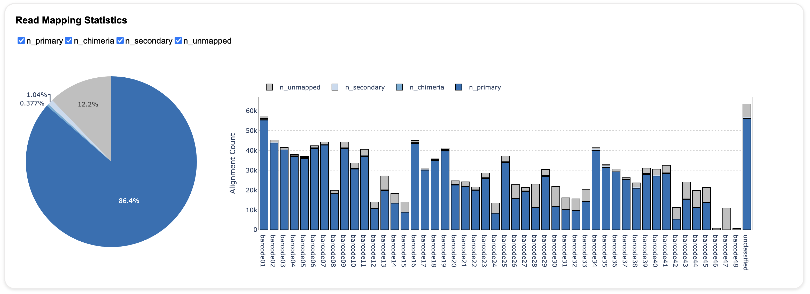
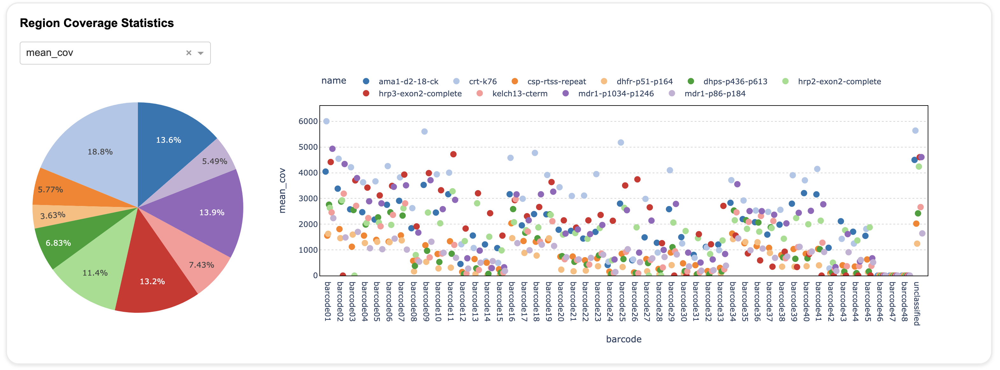
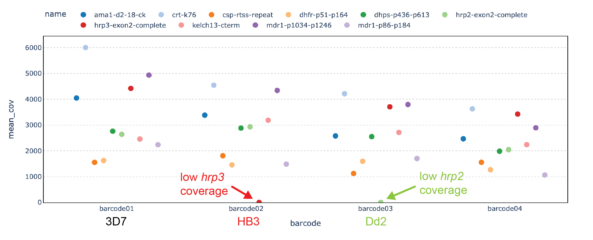
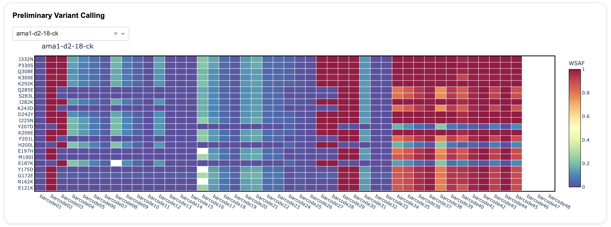

The *Nomadic* dashboard provides information about:

- Read mapping statistics
- Region (i.e. amplicon) coverage statistics
- Variant calling
<!-- - Region (i.e.) amplicon coverage profiles -->

Each of these outputs has it's own panel in the dashboard, as is described in more detail below.

## Read Mapping Statistics 

The top panel in the dashboard **displays information about read mapping**. 

!!! note 
    Read mapping is the process whereby sequencing reads are aligned to a reference genome based on sequence similarity. The objective of read mapping is to find the location in the reference genome from which a sequencing read likely originated. Sometimes, a single good alignment can be found for a read, but sometimes no good alignments, or multiple equally good alignments are found.

In *Nomadic*, information about read mapping is displayed in a stacked barplot. For each sequenced sample (x-axis), the total height of the bar is the number of alignments produced after all the reads from that sample were mapped. The colours in the stacked bar indicate the type of alignment that was generated for each read:

- Reads with **only one unique alignment** to the reference genome are shown in dark blue. These are called primary alignments, and are labeled `n_primary`. These are the best for downstream analysis.
- Reads with **no alignments** to the reference genome are shown in grey. These are unmapped reads, and labeled `n_unmapped`. 
- Reads with **two or more alignments** to the reference are labeled in the lighest shade of blue. These are called secondary alignments, are are labeled `n_secondary`. These can occur when a sequencing read originates from a repetitive region of the genome.
- Reads that must be **split in peices to be aligned** to the reference genome are shown in the middle shade of blue. These are called chimeric alignments, and are labeled `n_chimera`. These are usually caused by technical factors during library preparation of sequencing, but can also indicate structural varation.

The pie chart at the left displays the overall read mapping distribution across all sequenced samples.

Other points to note:

- In the y-axis labels, 'k' refers to thousands. So 10k = 10,000.
- If you are sequencing with NOMADS-MVP, lower parasitemia samples will have more unmapped reads (grey).

## Region Coverage Statistics
The second panel of the dashboard **displays information about the amount of coverage over your target regions**. For amplicon sequencing, the target regions are defined by your amplicons. 

!!! note
    Coverage is a measure of the number of sequencing reads that 'cover' a given position of the genome. By position, we mean a single nucleotide in the genome. A read covers that position if, after *read mapping*, its alignment includes the position. The *mean coverage* over a region is the mean of the coverage of all the positions included in the region.

*Nomadic* displays this information as a scatter plot. For each sample (x-axis), a point will be drawn for each target region. The color indicates the identity of the target region and there is a legend at the top of the plot. For example, in NOMADS-MVP, the pink points correspond to *kelch13*. The y-axis gives the mean coverage (`mean_cov`), number of reads (`n_reads`) or percentage of bases with greater than 100x coverage (`cov_gr100_per`), depending on what is selected in the drop down menu located above the pie chart.

The pie chart aggregates information across all samples. In an ideal scenario, the slices of the pie will be close to equal, indicating that the different target regions have similar coverage. In practice, coverage can vary between targets due to differences in PCR efficiency. As long as the lowest abundance amplicon is still recieving sufficient coverage (typically 100x), this is not a major problem.

### Identifying candidate *hrp2/3* deletions with NOMADS-MVP

You can use the 'Region Coverage Statistics' panel to identify candidate *hrp2* and *hrp3* deletions.

## Preliminary Variant Calling
The bottom panel of the dashboard **displays information about variant calling**. 

*Nomadic* displays variant calling information as a heatmap for each target region. You can select different target regions using the drop down menu at the top left.
In the heatmap, the samples are on the x-axis and the variants (i.e. mutations) are on the y-axis. The color in each cell of the heatmap gives the within-sample alternative allele frequency (WSAF).

!!! note
    The within-sample alternative allele frequency (WSAF) is the *fraction* of sequencing reads that carry the alternative allele (i.e. variant or mutation).

- **Dark blue (WSAF = 0)** indicates that none of the reads from the sample carry the mutation. 
    - **The sample does not have the mutation.**
- **Dark red (WSAF = 1)** indicates that all of the reads from the sample carry the mutation.
    - **The sample has the mutation.**
- **Intermediate colors like light blue, yellow and orange (0 < WSAF < 1)** indicate that some, but not all, of the reads from the sample carry the mutation.
    - **The sample is heterozygous for the mutation**
    - In the context of *P. falciparum* malaria, this suggests that the sample is polyclonal, and only some of the clones have the mutation.
- **A white cell** indicates that not enough data has been collected to determine the variant status of the sample. More sequencing is required.

In the plot above displays the target *ama1* for a set of control samples. The first three barcodes are 3D7, HB3 and Dd2. They are monoclonal, so all mutations are either dark blue (WSAF=0) or dark red (WSAF=1). After that, we have mixed strains together at different proportions, making them polyclonal, which leads to intermediate colors. The last three barcodes (46, 47, 48) are negative controls, and so they are not displaying any color.